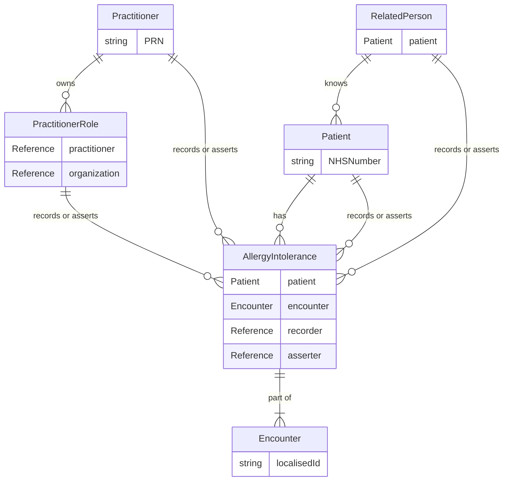

## Allergy and Intolerance Implementation Guide

## Allergy Data Model

An Allergy API Allergy record is made up of an AllergyIntolerance resource and any other 'detail' resources that are provided as part of the Allergy record in the specific domain.

### AllergyIntolerance 

The allergy record is made up of AllergyIntolerance resources which are supported by Patient, Practitoner, RelatedPerson Provenance and Encounter resources.

The patient and one or more practitioners take part in an encounter.  

The encounter represents a meeting of persons, involved for a specific reason, and this can be face to face, virtual and with or without the patient present. 

There may be situations where there is no encounter, especially if the patient or related person is making the record.

A Practitioner represents a health care worker. The health care worker may be assigned a specific role, for example general practitoner, specialist nurse, or consultant.

The practitioner will record the allergy. As they do this, the practitioner may record a specific substance that triggered a specific reaction.

#### Use cases

The following use cases are available. See [use cases](usecase/index.md) for an overview or the following links for details and examples.

*  [View allergy records for a patient](usecase/view-record/index.md)

* [Add an allergy or intolerance for a patient](usecase/add-allergyIntolerance/index.md)

* [Update an allergy or intollerance for a patient](usecase/update-allergyIntolerance/index.md)

