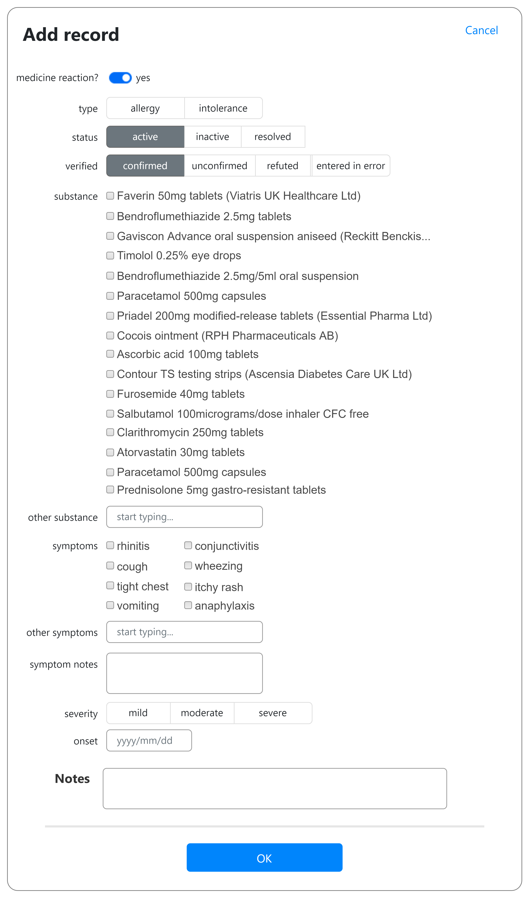
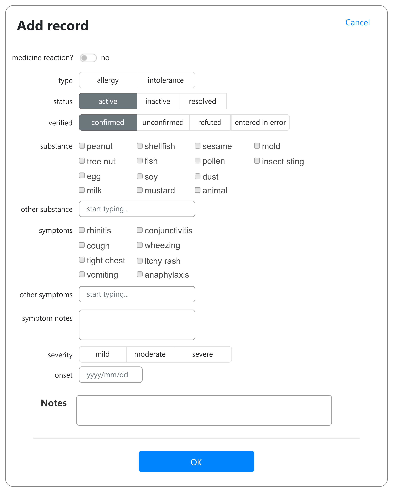
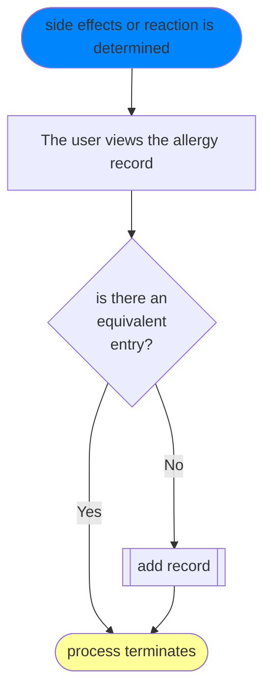
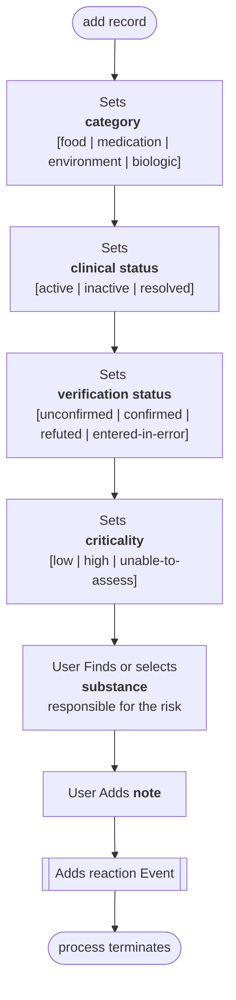
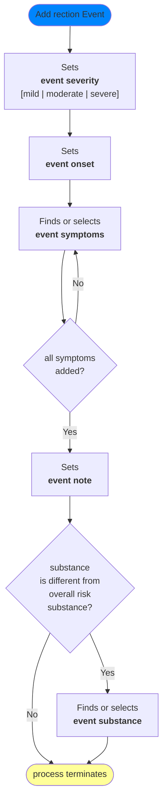

# Add an allergy or intolerance for a patient

> jump to : [Wireframes](#wireframes) | [diagrams](diagrams)
  
## Wireframes

Wireframes are not prescriptive. See notes on [how to use wireframes](url)

**Walk-through samples**
* [Add medicine allergy](#add-view-medicine-allergy)
  * [general medication example](general%20medication%20allergy%20-%20add.md)
  * [specific medication example](specific%20medication%20allergy%20-%20add.md)
* [Add other allergy](#add-view--other-allergy)
 
### User goals

* add a new record of a side effect for a patient

### Interface goals

* minimise cogntive load
* minimise screen time 
* minimise need for a keyboard and mouse
* use data intelligently

### Add view: medicine allergy

#### The user can:

1. see data from the patients medicines record when they select *medicine reaction*
   1. all SHOULD be backed by an entity using the DM+D coding system
2. find other medicines 
   1. the type ahead box finds matching values in SNOMED terminology, looking for concepts with an  'is a' relationship to 'UK product'
   2. If the concept behind the user selection has DM+D attributes, the DM+D coding system can be used alongside the SNOMED code
3. select from common symptoms
   1. all  SHOULD be backed by an entity using the SNOMED  coding system
4. find other symptoms 
   1. the type ahead box finds matching values in SNOMED terminology, looking for concepts with an  'is a' relationship to 'findings'
   2. the user can repeat this action for each additional symptom
5. enter partial dates for onset

### Add view:  other allergy

#### The user can:

1. see common substances know to cause food, boilogical or environmental allergic responses.
   1. all SHOULD be backed by an entity using the SNOMED coding system
2. find other substances
   1. the type ahead box finds matching values in SNOMED terminology, looking for concepts with an  'is a' relationship to 'substance'
   2. typing without a match results produces a text only coding
3. select from common symptoms
   1. all  SHOULD be backed by an entity using the SNOMED  coding system
4. find other symptoms 
   1. the type ahead box finds matching values in SNOMED terminology, looking for concepts with an  'is a' relationship to 'findings'
   2. the user can repeat this action for each additional symptom
5. enter partial dates for onset

## Diagrams

### Process: Add alergy or intolerance

### Sub-process: Add Record

### Sub-process:  Add Reaction Event

