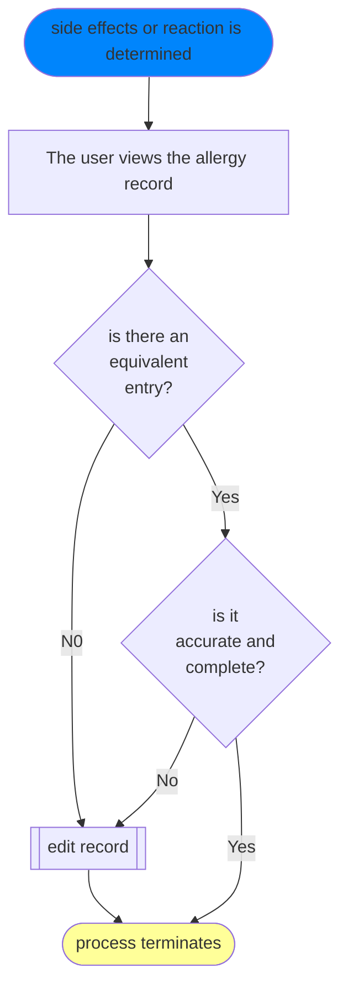
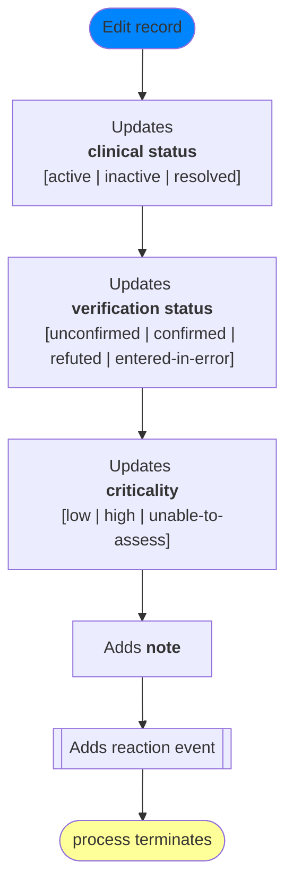
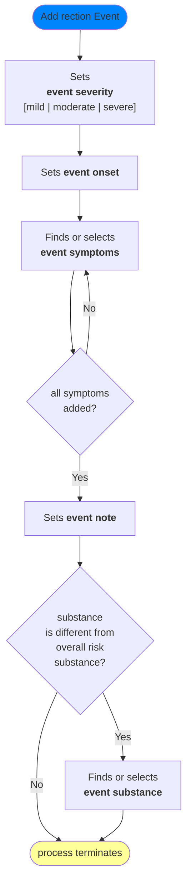

# Update an allergy or intolerance for a patient

## Wireframes

Wireframes are not prescriptive. See notes on [how to use wireframes](../index.md#understanding-wireframes)

### User goals

* add a new record of a side effect for a patient

### Interface goals

* minimise cogntive load
* minimise screen time 
* minimise need for a keyboard and mouse
* use data intelligently

### Process: Update alergy or intolerance 

### Sub-process: Edit Record

### Sub-process:  Add Reaction Event

