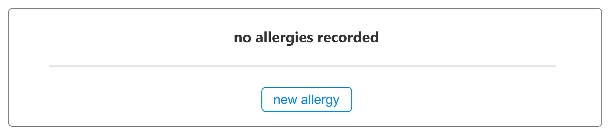

# View allergy records for a patient

## Wireframes

These wireframes are not prescriptive. Wireframes are intended to provide design guidance, where needed, to help users complete tasks.  Quality measures, if you need to assess wireframes, should consider information archiecture and user experience. Colours and the layout are indicative of visual priority and do not reflect a production-ready design.

### User goals:

* see all records of allergies for a patient

### Interface goals:

* minimise screen time 
* provide a safe overview- enough to eliminate accidental risk of harm
* show more information as needed
* minimise need for a keyboard and mouse

### List view: no entries

#### Notes

1. The user can clearly see there is no record of allergies
2. the user can create a new entry (when permitted)

### List view: positive negation statement

#### Notes

1. The user can clearly see an entry stating there are no allergies
   1. they can see the status of it
   2. they can see when it was last updated
   3. they can see more details may be available
2. the user can create a new entry (when permitted)

### List view:  record with two entries

#### Notes

1. The user can clearly see two entries
   1. they can see the substance of each
   2. they can see the status of each
   3. they can see how critical the entries are
   4. they can see when each was last updated
   5. they can see more details may be available
2. they can see the most recent entries first by when they were last updated
3. the user can create a new entry (when permitted)

### List view:  record with entry expanded A

#### Notes

1. The user can clearly see two entries
2. One of the entries is showing more details
   1. they can see the notes and when the notes were made
   2. they can see reaction events and for each:
      1. they can symptoms
      2. they can see the substance that caused the symtoms  (if known)
      3. they can see when it was recorded and who recorded it
      4. they can see notes about symptoms
   3. they can see how to make changes to it  (when permitted)
3. they can see the most recent entries first by when they were last updated
4. the user can create a new entry (when permitted)

### List view:  record with entry expanded B

#### Notes

1. The user can clearly see two entries
2. One of the entries is showing more details
   1. they can see the notes and when the notes were made
   2. they can see the notes are order chronologically
   3. they can see reaction events and for each:
      1. they can symptoms
      2. they can see the substance that caused the symtoms  (if known)
      3. they can see when it was recorded and who recorded it
      4. they can see notes about symptoms
   4. they can see how to make changes to it  (when permitted)
3. they can see the most recent entries first by when they were last updated
4. the user can create a new entry (when permitted)

